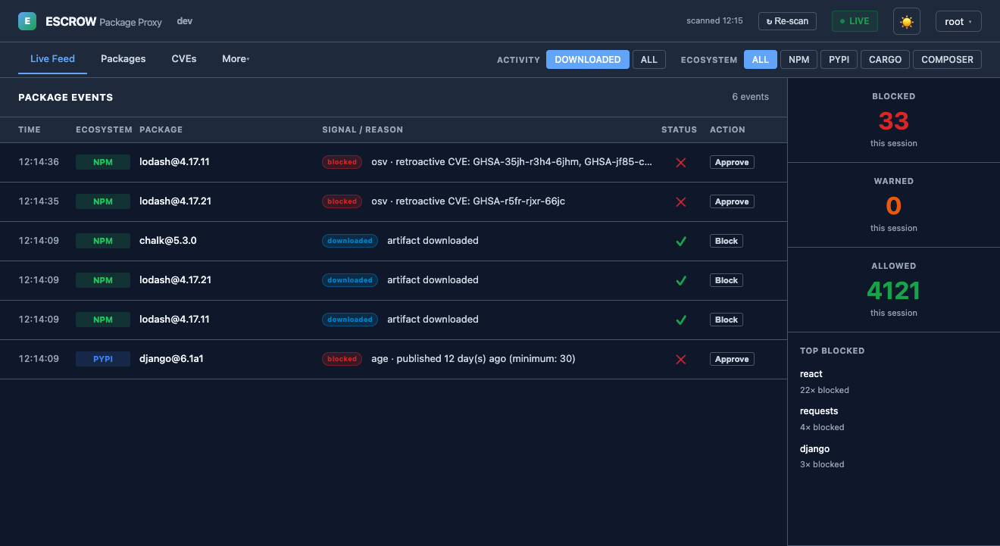
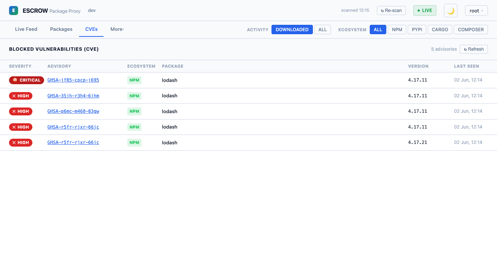
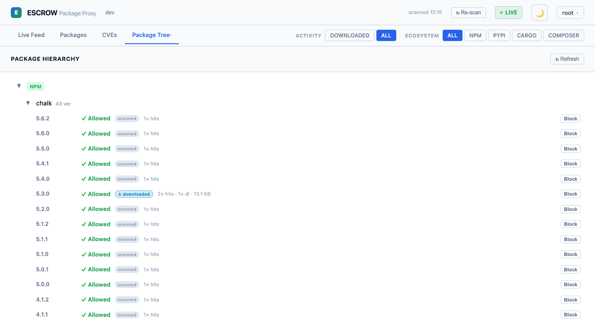
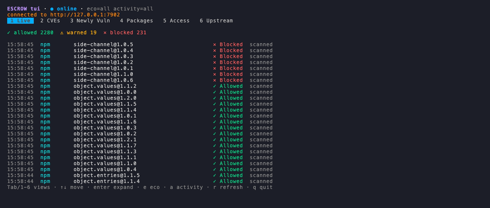

# 🔒 escrow

**A supply-chain firewall for your package managers.** escrow sits between your developers (or CI) and the public registries — npm, PyPI, Go, Cargo, NuGet, Maven/Gradle, Composer — and won't hand over a package until it has passed your policy: a minimum **age**, a clean **OSV** vulnerability record, a known **publisher**. One static binary, seven ecosystems, a real-time dashboard in the browser **and** the terminal.

<p>
  
  
  
  
  
  
</p>

```
developer / CI  →  escrow proxy  →  upstream registry
                         │
                   policy engine
            ┌────────────┼─────────────┐
           age          osv       publisher · popularity
```

A package that fails policy is **removed from the manifest before the tool ever sees it** — not an error a `--force` can override, just a version that appears not to exist. Blocked events surface in the dashboard, where an operator approves with one click. And because new CVEs land every day, escrow keeps **re-scanning what you already pulled** and flags anything that turned vulnerable after the fact.

| npm | PyPI | Go | Cargo | NuGet | Maven / Gradle | Composer |
|:---:|:----:|:--:|:-----:|:-----:|:--------------:|:--------:|
| ✅ | ✅ | ✅ | ✅ | ✅ | ✅ | ✅ |



> Real-time operator console — light/dark, color-blind-safe — and a full terminal UI (`escrow-cli tui`) for the same views over SSH.

**Jump to:** [Why escrow?](#-why-escrow) · [Quick install](#-quick-install) · [See it in action](#-see-it-in-action) · [Documentation](#-documentation)

---

## 🤔 Why escrow?

Most supply-chain attacks don't exploit a clever bug — they ship a **brand-new version of a package you already trust**, from a hijacked maintainer account, and race to spread before anyone notices. By the time an advisory exists, the malware has been in `node_modules` for hours.

escrow's core bet is **time**. A version published *today* can't be installed through the proxy until it has aged past your threshold (say, 7 days) — long enough for the community, the registry, and the scanners to catch a bad release and pull it. The attacks below were all caught and removed within **hours to a couple of days**. With a 7-day quarantine, none would have reached a developer installing through escrow:

| Incident | What happened | Closed by |
|---|---|:--|
| **ua-parser-js** · Oct 2021 | Hijacked maintainer account published `0.7.29 / 0.8.0 / 1.0.0` with a cryptominer + credential stealer — live on npm for **~4 hours** | 🗓️ age gate |
| **coa** & **rc** · Nov 2021 | Same playbook days later: account takeover, malicious new versions, pulled within hours | 🗓️ age gate |
| **colors** & **faker** · Jan 2022 | Maintainer self-sabotage shipped an infinite-loop `colors@1.4.44-liberty-2`, breaking thousands of builds overnight | 🗓️ age gate |
| **Log4Shell** · CVE-2021-44228 | A *known* critical CVE in `log4j-core` (Maven) — not new, but catastrophic | 🔍 OSV scan + 🔁 re-scan |

The **age gate** closes the *zero-day-malware-in-a-fresh-version* window; the **OSV scan** and **continuous re-scan** close the *known-CVE* window — including CVEs disclosed **after** you downloaded a package. escrow is also deliberately honest about what it *can't* stop (postinstall hooks, typosquatting, git deps) — see [Security model & threat coverage](docs/security.md).

> This is not "catches everything." It's a focused, layered gate over the **most common and most time-sensitive** attack window — and it tells you plainly where it doesn't reach.

---

## 🚀 Quick install

### 🍺 Homebrew (macOS — recommended)

```bash
brew tap jverhoeks/tap
brew install escrow

brew services start escrow      # background service, auto-starts on login
# → http://localhost:7888/dashboard
# credentials are printed to: $(brew --prefix)/var/log/escrow.log
```

Config lives at `$(brew --prefix)/etc/escrow/escrow.toml`; `brew services restart escrow` to reload. The formula also installs **`escrow-cli`** — the companion that routes your dev environment through the proxy, watches activity, and reloads config. See [Routing traffic to escrow](docs/routing.md).

### 🐳 Docker

```bash
docker run -p 7888:7888 ghcr.io/jverhoeks/escrow:latest
# or, with a full debug config (all 7 ecosystems, admin / escrow):
cd docker/ && mkdir -p data && cp escrow.debug.toml data/escrow.toml && docker compose up -d
```

### 📦 Binary

```bash
# pick your platform: darwin-arm64 · darwin-amd64 · linux-amd64 · linux-arm64
curl -L https://raw.githubusercontent.com/jverhoeks/escrow/main/escrow-darwin-arm64 -o escrow
chmod +x escrow && ./escrow            # binds 127.0.0.1:7888 (localhost only)
./escrow --host=0.0.0.0                # listen on all interfaces (team/CI use)
```

On first boot escrow generates `escrow.toml` with a random dashboard password and prints the credentials to stdout — save them.

---

## 🌐 Supported ecosystems

| Ecosystem | Tools | Proxy URL | Config key |
|-----------|-------|-----------|------------|
| npm | npm, pnpm, yarn, bun | `http://localhost:7888/` | `npm = true` |
| PyPI | pip, uv | `http://localhost:7888/pypi/simple/` | `pypi = true` |
| Go modules | go | `http://localhost:7888/go/` | `go = true` |
| Cargo | cargo | `http://localhost:7888/cargo/` | `cargo = true` |
| Composer | composer | `http://localhost:7888/composer/` | `composer = true` |
| NuGet | dotnet, nuget | `http://localhost:7888/nuget/index.json` | `nuget = true` |
| Maven / Gradle | mvn, gradle | `http://localhost:7888/maven2/` | `maven = true` |

→ Step-by-step setup for each tool: **[per-tool quickstarts](docs/quickstart/)**.

---

## 📸 See it in action

A real-time operator console — light/dark, color-blind-safe (icons **and** color), with shared
**Activity** and **Ecosystem** filters — plus a full terminal UI for the same views over SSH.

| CVEs blocked by advisory | Package tree (downloaded + flagged) | Terminal UI — live feed |
|:---:|:---:|:---:|
|  |  |  |

→ **[Full visual tour: dashboard & terminal UI →](docs/dashboard.md)**

---

## 📚 Documentation

| Guide | What's inside |
|---|---|
| **[Dashboard & terminal UI](docs/dashboard.md)** | Every view, light/dark, the `escrow-cli tui`, approve/block — with screenshots |
| **[Policy, scanning & lists](docs/policy.md)** | Age gate · OSV · publisher · popularity · continuous re-scan · settings & hot-reload · allow/blocklist |
| **[Routing traffic to escrow](docs/routing.md)** | The 4 methods: config files · local · shell/launch env · network redirect — and a coverage matrix |
| **[Security model & threat coverage](docs/security.md)** | What it does and doesn't protect against · trust pipeline · dashboard hardening · comparison |
| **[Deployment, storage & alerts](docs/deployment.md)** | TLS · internal mirrors · health · disk cache · systemd · S3 storage · webhooks |
| **[Configuration reference](docs/configuration.md)** | Every `escrow.toml` key, with defaults |
| **[GitHub Actions](docs/github-actions.md)** | One-step CI supply-chain gate + Renovate composition |
| **[escrow-cli reference](docs/escrow-cli.md)** | All `escrow-cli` commands: setup · config · status · tui · live · reload |
| **[Per-tool quickstarts](docs/quickstart/)** | npm · pnpm · yarn · bun · pip · uv · go · cargo · composer · dotnet · maven · gradle |

---

## ⚡ GitHub Actions

Use escrow as a one-step supply-chain gate in any CI pipeline — add it before your install steps, no other changes needed:

```yaml
steps:
  - uses: actions/checkout@v6

  - uses: jverhoeks/escrow@v1
    with:
      ecosystems: 'npm'
      min-days: '7'
      osv-severity: 'HIGH'

  - uses: actions/setup-node@v6
    with: { node-version: '20' }

  - run: npm install --ignore-scripts   # automatically uses the escrow registry
```

Escrow exports `NPM_CONFIG_REGISTRY`, `PIP_INDEX_URL`, `GOPROXY`, etc. so every install routes through the proxy, and caches packages in the Actions cache between runs.

→ Full guide, inputs/outputs, caching, and Renovate composition: **[docs/github-actions.md](docs/github-actions.md)**.

---

## 🔨 Building from source

```bash
git clone https://github.com/jverhoeks/escrow
cd escrow
go build -o escrow     ./cmd/escrow        # proxy server
go build -o escrow-cli ./cmd/escrow-cli    # companion CLI (macOS / Linux)
go test ./...
```

---

## 📄 License

[MIT](LICENSE) © 2026 Jacob Verhoeks
