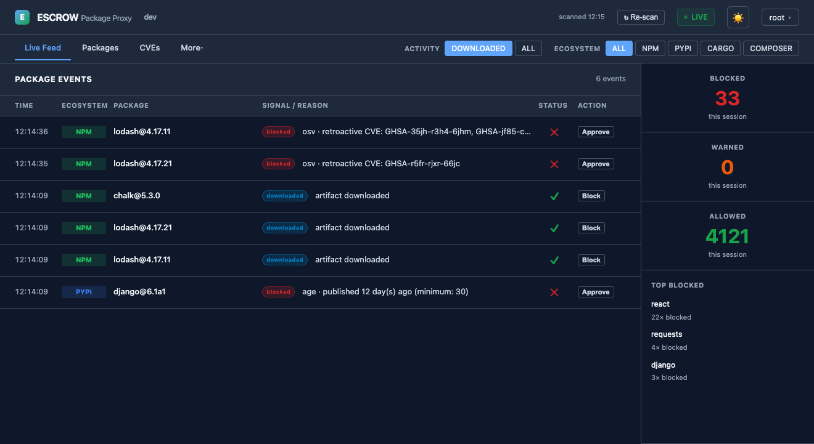
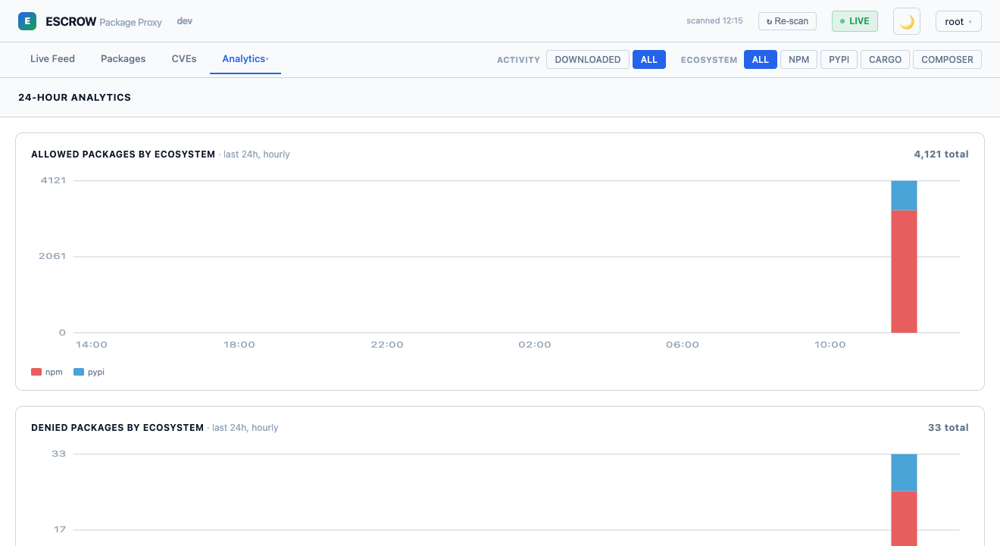
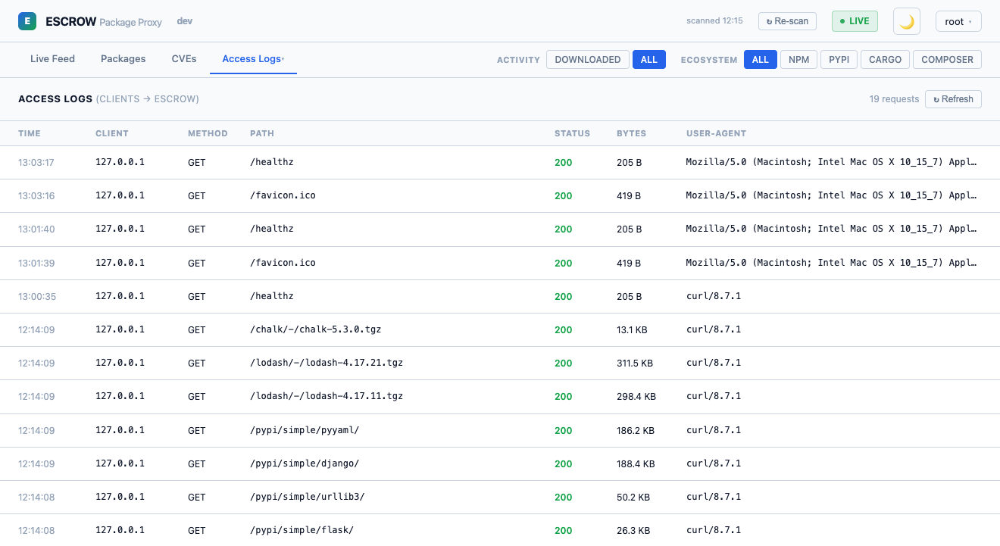
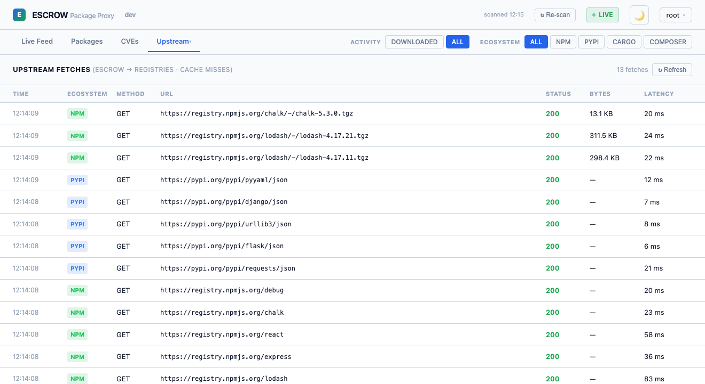
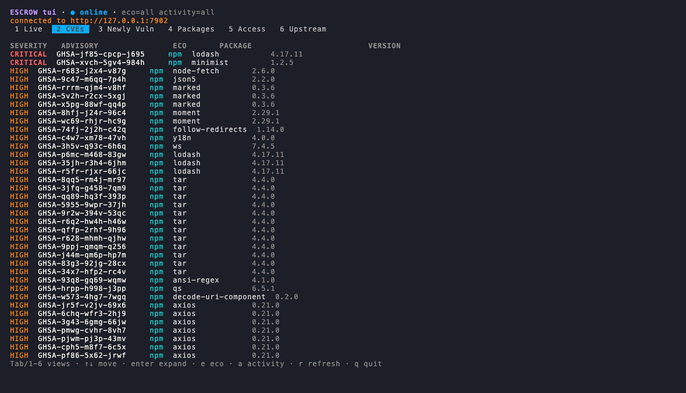
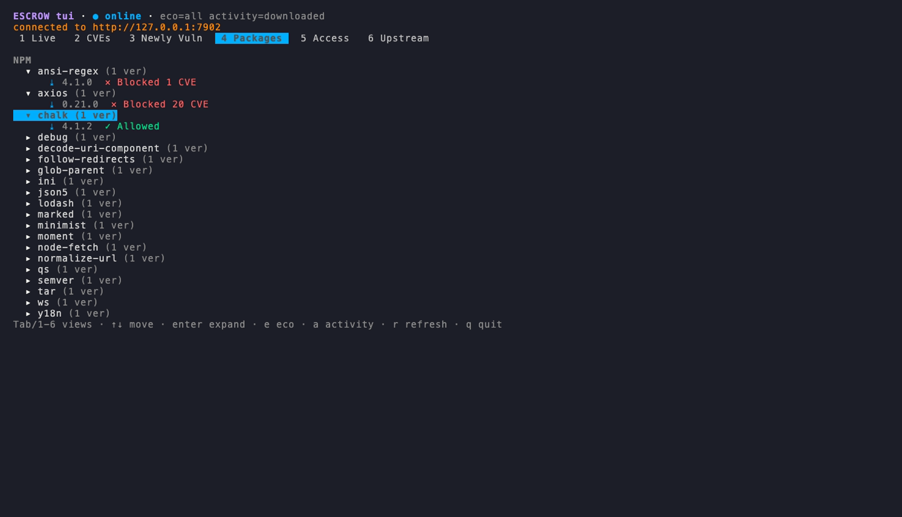

# 📸 Dashboard & Terminal UI

[← Back to README](../README.md) · Related: [Policy & scanning](policy.md) · [escrow-cli reference](escrow-cli.md)

escrow ships a real-time operator console in **two forms** — a web dashboard and a full
terminal UI — both backed by the same local API. Status is coded with **icons *and* color**
(never color alone), so it stays readable for color-blind operators, and both light and dark
themes follow your OS.

Open the web dashboard at `http://localhost:7888/dashboard`. Credentials are printed on first
boot and stored in `$(brew --prefix)/var/log/escrow.log`. An **Activity** filter
(Downloaded / All) and an **Ecosystem** filter are shared across every view.

---

## The web dashboard

### Live Feed

Every package event as it happens, with running blocked/warned/allowed counts and the
top-blocked packages. Each row shows the classification (`scanned` / `downloaded` / `blocked`)
and a one-click **Approve** / **Block** action.


### CVEs

Every version blocked by a vulnerability, grouped by advisory with severity and a link to the
OSV / GitHub advisory.


### Package Tree

Ecosystem → namespace/package → version, collapsed by default. Each version shows its status,
`scanned` / `downloaded` marker, hit & download counts, size, and a Block/Approve button.


### Newly Vulnerable

Packages that gained a CVE *after* you downloaded them, surfaced by the
[continuous re-scanner](policy.md#-continuous-cve-re-scan) with how many times each was pulled —
so you can triage real exposure first.


### Settings

View and edit the whole configuration from the browser (everything except the dashboard
password, which is read-only and never writable via the API), with a **Validate** button and a
live **hot-reload** — see [Settings & hot-reload](policy.md#-settings--hot-reload).


### Light & dark

Both themes follow your OS preference and use the same color-blind-safe status coding.

| Light | Dark |
|:---:|:---:|
|  |  |

### More views

Under **More ▾**: **Analytics** (24-hour stacked-column trends per ecosystem), **Access Logs**
(clients → escrow), and **Upstream** (escrow → registries, i.e. cache misses).

| Analytics | Access logs | Upstream fetches |
|:---:|:---:|:---:|
|  |  |  |

### Approving & blocking

**Approve a blocked package:** click **Approve** on any blocked event (or version in the tree).
Added to `escrow-allowlist.json` immediately — no restart. **Block manually:** the **Block**
button, or `POST /dashboard/api/block`. All allow/block actions are recorded in the live feed
with the operator's username. See [Allowlist and Blocklist](policy.md#-allowlist-and-blocklist).

---

## Terminal UI — `escrow-cli tui`

Prefer the terminal? `escrow-cli tui` (alias `escrow-cli --tui`) is an interactive,
keyboard-driven dashboard that mirrors the web views over the local API, with an offline
event-log fallback.

```bash
escrow-cli tui
```

It auto-discovers the running proxy and logs in from your `escrow.toml`; pass
`--url/--user/--password` to point at a remote instance. Keys: **Tab** / **1–6** switch views ·
**↑↓** move · **enter** expand (Packages) · **e** ecosystem · **a** activity · **r** refresh ·
**q** quit. Views: Live (+stats), CVEs, Newly Vulnerable, Packages, Access, Upstream.

| Live feed (allow / block, live) | CVEs (by advisory) | Packages (collapsible tree) |
|:---:|:---:|:---:|
|  |  |  |

`escrow-cli live [--eco npm] [--activity downloaded|scanned|blocked]` tails the event log as
plain colorized lines — handy for piping or a side pane.

For the full command reference, see [escrow-cli.md](escrow-cli.md).
