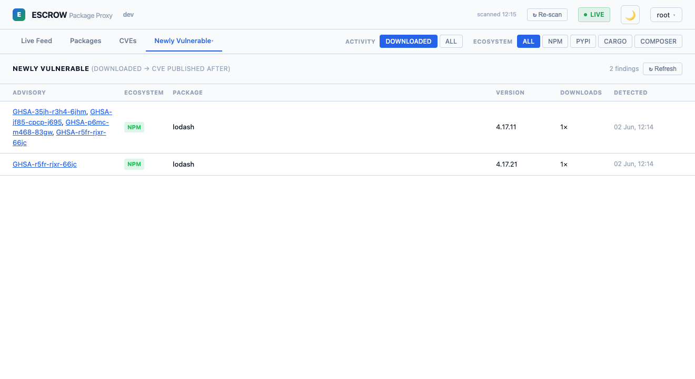
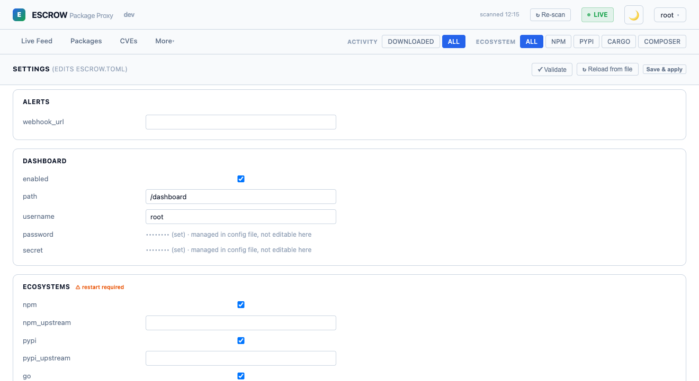

# ⚙️ Policy, scanning & lists

[← Back to README](../README.md) · Related: [Security model](security.md) · [Configuration reference](configuration.md)

How escrow decides what to allow, warn on, or block — and how to keep that decision current as
new CVEs are disclosed.

---

## ⚙️ Policy configuration

All policy lives in `escrow.toml`. Without a `[policy]` section escrow proxies transparently
(with a startup warning).

### 🗓️ Age gate

Blocks packages published fewer than N days ago. Catches injection attacks that publish and
spread quickly before the community notices.

```toml
[policy.age]
  min_days = 7       # packages must be at least 7 days old
  action   = "block" # block | warn | allow
```

| `min_days` | Use case |
|-----------|----------|
| 1 | Catch same-day injections |
| 7 | Recommended baseline |
| 30 | High-security environments |

### 🔍 OSV vulnerability scan

Checks every package version against the [Open Source Vulnerability database](https://osv.dev).

```toml
[policy.osv]
  min_severity = "MEDIUM"  # LOW | MEDIUM | HIGH | CRITICAL
  action       = "block"
```

Results are cached 24 hours per version.

> 💡 **Fail-open:** If the OSV API is unreachable or returns a non-200 response, the vulnerability signal returns `skip` and the package is **allowed through**. This is intentional — a transient OSV outage should not block all package installs. If you need fail-closed behavior, mirror the OSV database locally or use `action = "warn"` so blocks require an explicit allowlist entry rather than automatic OSV approval.

### 👤 Publisher account age

```toml
[policy.publisher]
  max_account_age_days = 30
  action               = "warn"
```

For npm: reads `_npmUser` (set by the registry at publish time). Publisher lookup results are
cached 1 hour per account.

> 💡 **Fail-open:** If the npm registry API is unreachable, the publisher signal returns `skip` and the package passes through.

### 📈 Download spike detection

```toml
[policy.popularity]
  spike_factor = 10.0  # warn if downloads increased >10× week-over-week
  action       = "warn"
```

### 🐍 Block source distributions (PyPI)

```toml
[policy.pypi]
  block_sdist = true  # wheel-only; never run setup.py at install time
```

### 🚦 Policy actions

| `action` | Effect |
|---------|--------|
| `block` | Removed from manifest/metadata — tools see it as non-existent |
| `warn`  | Allowed through; event logged with WARN status |
| `allow` | Signal evaluated but never blocks (monitoring mode) |

---

## 🔁 Continuous CVE re-scan

OSV is checked when a package is first fetched — but new CVEs are published every day. The
background **re-scanner** periodically re-checks the versions you've actually **downloaded**
against OSV, and on a *new* finding it records it, fires the webhook, and (by default)
auto-adds the version to the blocklist. Findings appear in the **Newly Vulnerable** view with
how many times the package was pulled, for triage.



```toml
[rescan]
  enabled        = true   # default
  interval_hours = 24     # default; also a manual "Re-scan now" button + POST /api/rescan
  auto_block     = true   # default; set false for alert-only
  min_severity   = "HIGH" # defaults to policy.osv.min_severity
```

A daily sweep catches a freshly-disclosed CVE on something already in your builds within ~24h;
auto-block is severity-gated and can be turned off for alert-only.

---

## 🔄 Settings & hot-reload

You can view and edit the whole config from the dashboard's **Settings** page (everything
except the dashboard password, which is shown read-only and never writable via the API). A
**Validate** button checks a change before you save.



**Save** writes `escrow.toml` (backing up the previous file to `escrow.toml.bak`) and then
**hot-reloads** the live-reloadable parts immediately — **policy gates, `[rescan]`, and the
alerts webhook** apply without a restart. Changes to the listen socket, storage, ecosystems,
or the auth secret are reported as **restart-required**.

Reload is also available three other ways, all running the same in-process routine:

```bash
escrow-cli reload          # signals the running proxy (SIGHUP)
kill -HUP <pid>            # SIGHUP directly
curl -XPOST .../api/reload  # dashboard "Reload" button hits this
```

---

## ✅ Allowlist and Blocklist

### Via dashboard

Click **Approve** on any blocked event — added to `escrow-allowlist.json` immediately.
Click **Block** on any allowed event — added to `escrow-blocklist.json`.

### Via JSON files

`escrow-allowlist.json`:
```json
[
  {
    "ecosystem": "npm",
    "name": "lodash",
    "version": "4.17.21",
    "reason": "pinned to known-good version, reviewed by security team",
    "added_by": "admin",
    "added_at": "2026-05-16T14:00:00Z"
  }
]
```

`"version": ""` is a wildcard — approves all versions of the package.

Allowlist is checked **before** any policy signal. Approved packages bypass all trust checks
and are recorded with `signal: override`. See the full ordering in the
[trust pipeline](security.md#trust-pipeline).
